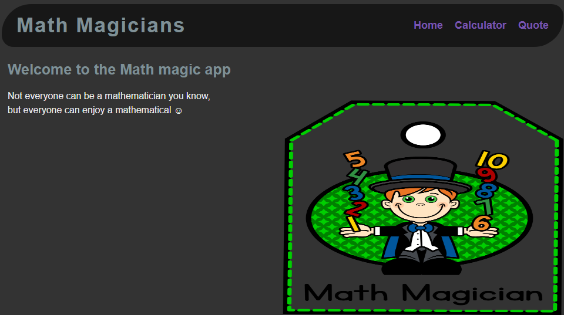

  <!-- You are encouraged to replace this logo with your own! Otherwise you can also remove it. -->
  
   

  <h3><b>Math Magician App </b></h3>

<!-- TABLE OF CONTENTS -->

# 📗 Table of Contents

- [📖 About the Project](#about-project)
  - [🛠 Built With](#built-with)
    - [Tech Stack](#tech-stack)
    - [Key Features](#key-features)
  - [🚀 Live Demo](#live-demo)
- [💻 Getting Started](#getting-started)
  - [Setup](#setup)
  - [Prerequisites](#prerequisites)
  - [Install](#install)
  - [Usage](#usage)
  - [Run tests](#run-tests)
  - [Deployment](#triangular_flag_on_post-deployment)
- [👥 Authors](#authors)
- [🔭 Future Features](#future-features)
- [🤝 Contributing](#contributing)
- [⭐️ Show your support](#support)
- [🙏 Acknowledgements](#acknowledgements)
- [❓ FAQ (OPTIONAL)](#faq)
- [📝 License](#license)

<!-- PROJECT DESCRIPTION -->

# 📖 [Math magician] 

> Describe your project in 1 or 2 sentences.

**[Math magician]** > It is a website for all fans of mathematics. It is a Single Page App (SPA) that allows users to make simple calculations, read a random math-related quote.

## 🛠 Built With 

### Tech Stack 

> Describe the tech stack and include only the relevant sections that apply to your project.

  
Technologies

  <ul>
    <li><a href="">NPM</a></li>
		<li><a href="">GIT</a></li>
		<li><a href="https://www.github.com/">GitHub</a></li>
  </ul>

  
Framework

  <ul>
    <li><a href="https://ReactJs.com/">React js</a></li>
  </ul>

Languages

  <ul>
    <li><a href="https://www.postgresql.org/">JavaScript</a></li>
		<li><a href="https://www.postgresql.org/">HTML&CSS</a></li>
  </ul>

<!-- Features -->

### Key Features 

> Describe between 1-3 key features of the application.

- **[key_feature_1Make simple calculation]**
- **[Read a random math-related quote]**

(<a href="#readme-top">back to top</a>)

<!-- LIVE DEMO -->

## 🚀 Live Demo 

> Add a link to your deployed project.

- [will be available soon](https://yourdeployedapplicationlink.com)

(<a href="#readme-top">back to top</a>)

<!-- GETTING STARTED -->

## 💻 Getting Started 

> Describe how a new developer could make use of your project.

To get a local copy up and running, follow these steps.

### Prerequisites

In order to run this project you need:

npm/yarn installed

### Setup

Clone this repository to your desired folder:

clone the repo: <code>git clone git@github.com:Marcraphael12/Math_magician.git</code> 
jump to the active branch: <code>git checkout [branch name]</code> 

### Install

Install this project with:

in the terminal, run: <code>npm install</code> or <code>npm i</code>

### Usage

To run the project, execute the following command:
<code>npm start</code>

### Run tests

To run tests, run the following command:
<code>npm run test</code>

(<a href="#readme-top">back to top</a>)

<!-- AUTHORS -->

## 👥 Authors 

> Mention all of the collaborators of this project.

👤 **Marc Raphael**

- GitHub: [@Marcraphael12](https://github.com/Marcraphael12)
- Twitter: [@Marcraphael20](https://twitter.com/MarcRaphael20)
- LinkedIn: [Marc raphael](http://www.linkedin.com/in/marc-raphael-326039204)

(<a href="#readme-top">back to top</a>)

<!-- FUTURE FEATURES -->

## 🔭 Future Features 

> Describe 1 - 3 features you will add to the project.

- [ ] **[new_feature_1]**
- [ ] **[new_feature_2]**
- [ ] **[new_feature_3]**

(<a href="#readme-top">back to top</a>)

<!-- CONTRIBUTING -->

## 🤝 Contributing 

Contributions, issues, and feature requests are welcome!

Feel free to check the [issues page](../../issues/).

(<a href="#readme-top">back to top</a>)

<!-- SUPPORT -->

## ⭐️ Show your support 

> Write a message to encourage readers to support your project

If you like this project...

(<a href="#readme-top">back to top</a>)

<!-- ACKNOWLEDGEMENTS -->

## 🙏 Acknowledgments 

> Give credit to everyone who inspired your codebase.

I would like to thank Microverse for the opportunity

(<a href="#readme-top">back to top</a>)

<!-- LICENSE -->

## 📝 License 

This project is [MIT](./MIT) licensed.

_NOTE: we recommend using the [MIT license](https://choosealicense.com/licenses/mit/) - you can set it up quickly by [using templates available on GitHub](https://docs.github.com/en/communities/setting-up-your-project-for-healthy-contributions/adding-a-license-to-a-repository). You can also use [any other license](https://choosealicense.com/licenses/) if you wish._

(<a href="#readme-top">back to top</a>)

